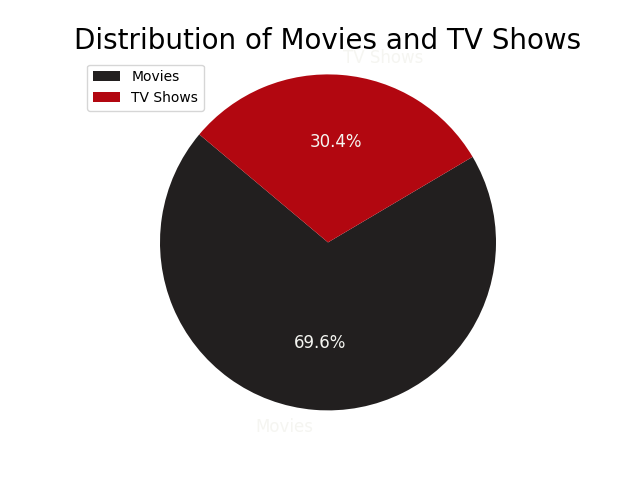
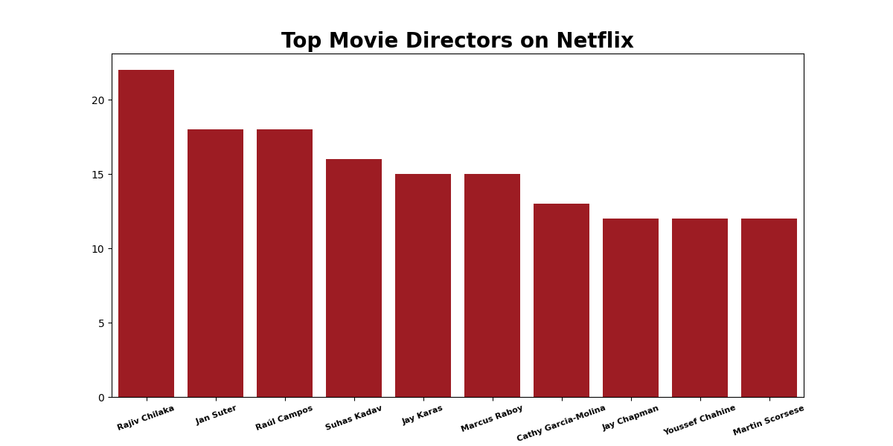
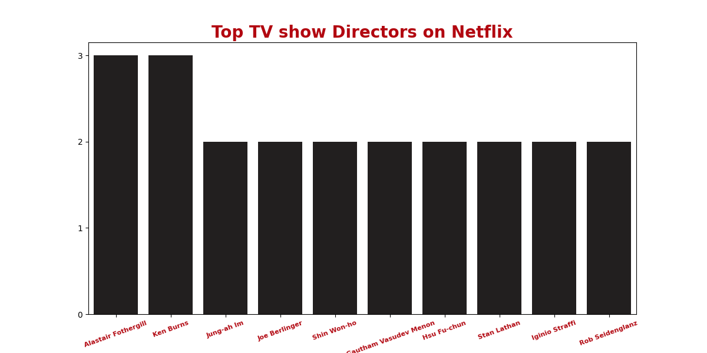
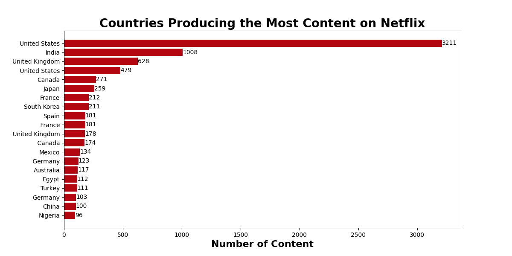
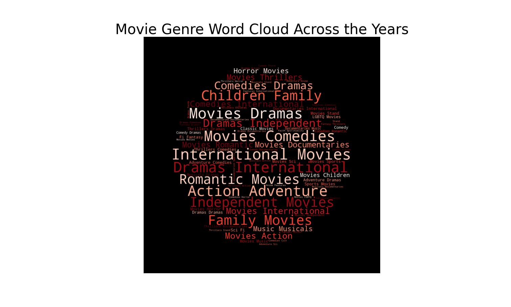
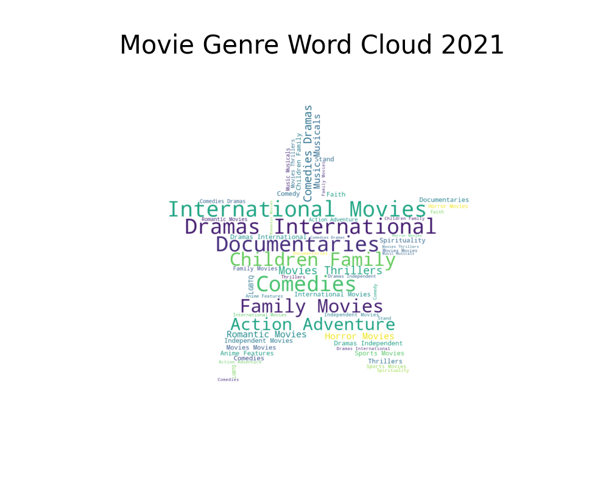
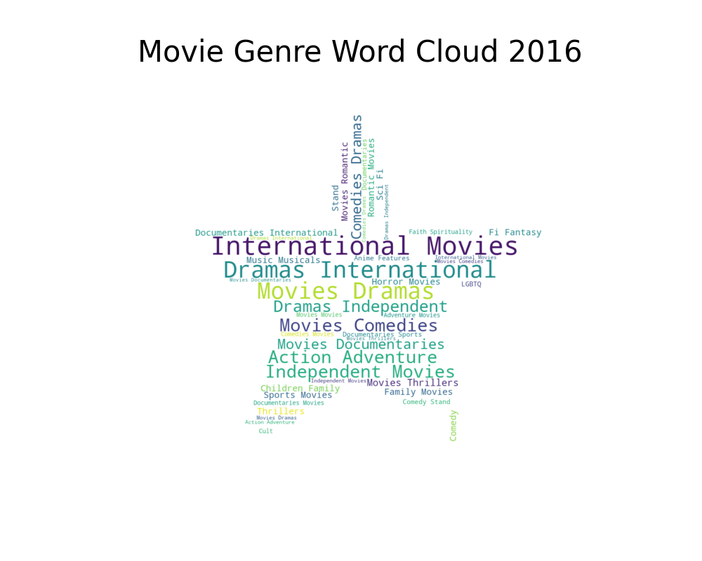
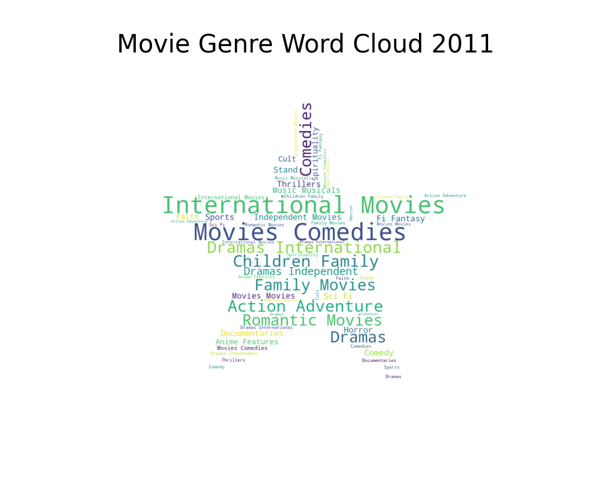
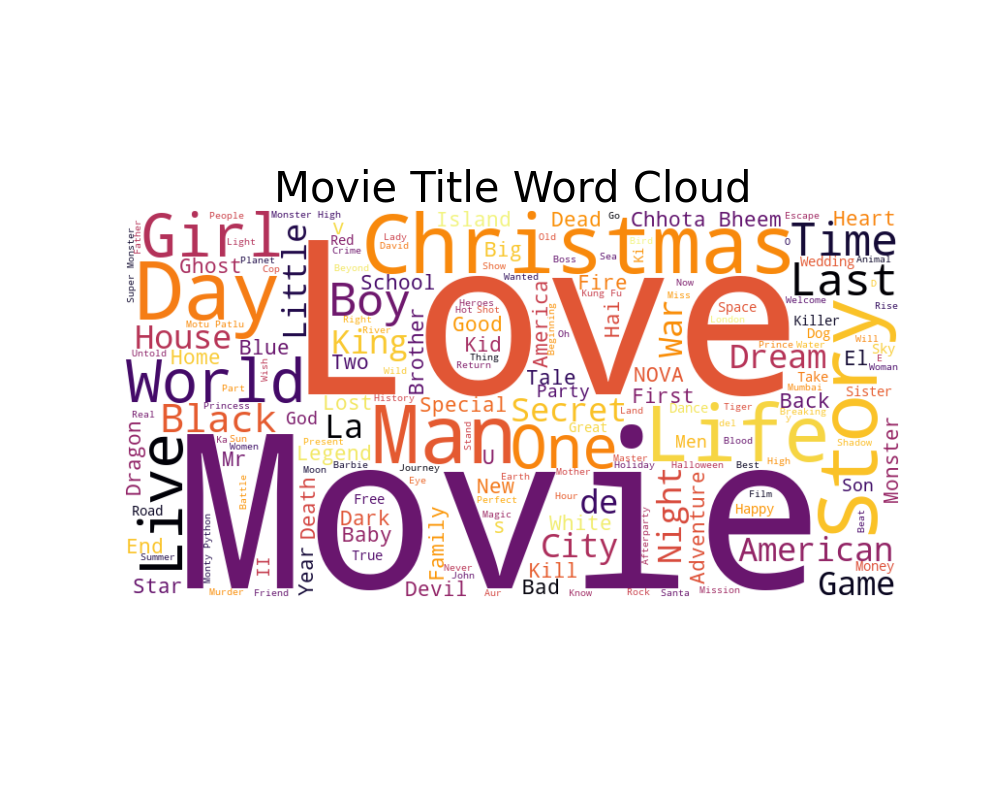

# Netflix Data Anlysis

Thsi is a data anlysis propject on the Netfelix dataset.

## Description

The Netflix Data Analysis project aims to explore and analyze the Netflix dataset to uncover patterns, trends, and interesting information about the content available on the platform. By conducting data analysis and visualization on this dataset, it aims to provide valuable insights into the types of content, distribution by country, release trends, and more.

## Table of Contents

- [Usage](#usage)
- [Features](#features)

## Usage

- Favorite Titles - Uncovering Popular Movie Picks

```
categories = ['Movies', 'TV Shows']
No_Of_Movie_TVShow = netflix.groupby(['type']).size()
total_rows = len(netflix)
total_rows = round(total_rows, 2)

ratio = No_Of_Movie_TVShow / total_rows

plt.pie(ratio, labels=categories, colors=['#221f1f', '#b20710'], autopct='%1.1f%%', startangle=140, textprops={'color': '#f5f5f1', 'fontsize': 12}, labeldistance=1.1)

plt.legend(categories, loc='upper left')

plt.axis('equal')

plt.title('Distribution of Movies and TV Shows', fontsize=20)

plt.show()
```



- Top Directors - Meet the Leading Filmmakers on Netflix

```
is_movie = netflix['type'] == 'Movie'
is_tv_show = netflix['type'] == 'TV Show'

movie_director_counts = netflix[is_movie]['director'].explode().value_counts()
plt.figure(figsize=(12, 6))
sns.barplot(x=movie_director_counts.head(10).index, y=movie_director_counts.head(10).values, color='#b20710')
plt.xticks(rotation=20, fontsize=8, fontweight='bold',)
plt.title('Top Movie Directors on Netflix', fontsize = 20,fontweight='bold')
plt.show()

tv_show_director_counts = netflix[is_tv_show]['director'].explode().value_counts()
plt.figure(figsize=(12,6))
sns.barplot(x=tv_show_director_counts.head(10).index, y= tv_show_director_counts.head(10).values, color='#221f1f')
plt.xticks(rotation=20, fontsize =8, color='#b20710',fontweight='bold' )
plt.yticks(range(0, max(tv_show_director_counts.head(10).values) + 1, 1))
plt.title('Top TV show Directors on Netflix', fontsize = 20, color='#b20710',fontweight='bold')
plt.show()
```





- Country Breakdown - Exploring Netflix's Content Origins

```
country_counts = netflix['country'].explode().value_counts()
country_counts_acs = country_counts.sort_values(ascending=False)

plt.figure(figsize=(12,6))

for i , (country, count) in enumerate(country_counts.head(20).items()):
     plt.barh(i, count, color='#b20710')
     plt.text(count,i, str(count), ha='left', va= 'center', color='black')

plt.yticks(range(20), country_counts_acs.head(20).index,fontsize = 10 )
plt.gca().invert_yaxis()
plt.xlabel('Number of Content',fontsize = 16,fontweight='bold')
plt.title('Countries Producing the Most Content on Netflix',fontsize = 20,fontweight='bold' )
plt.show()
```



- Genre Variety - Delving into Netflix's Different Show Types

```
python_mask = np.array(Image.open('/Users/karylam/Desktop/netflix/1000_F_311928582_JlynEjE0p4A7eOOsge79My3wkFvk0H2A.jpg'))
movie_genres = ' '.join(netflix[netflix['type'] == 'Movie']['listed_in'].explode().dropna())
movie_wordcloud = WordCloud(width=1200,
                            height=1200,
                            background_color='black',
                            normalize_plurals = True,
                            repeat = True,
                            stopwords=STOPWORDS,
                            mask=python_mask,
                            min_font_size = 10,
                            colormap='Reds').generate(movie_genres)

```









- Favorite Titles - Uncovering Popular Movie Picks

```
titles_preference_movie = ' '.join(netflix[netflix['type'] == 'Movie']['title'].dropna())

title_words = titles_preference_movie.split()
processed_titles = ' '.join(title_words)


titles_preference_movie_wordcloud = WordCloud(width=800,
                                              height=400,
                                              background_color='white',
                                              normalize_plurals = True,
                                              repeat = True,
                                              stopwords=STOPWORDS,
                                              min_font_size = 10,
                                              colormap='inferno').generate(processed_titles)

plt.figure(figsize=(10, 8))
plt.imshow(titles_preference_movie_wordcloud, interpolation='bilinear')
plt.axis('off')
plt.title('Movie Title Word Cloud', fontsize=30)
plt.show()
```

```
python_mask1 = np.array(Image.open('/Users/karylam/Desktop/netflix/cloud.jpg'))

years = [2021, 2016, 2011]

for year in years:
  movie_genres_years = ' '.join(netflix[(netflix['type'] == 'Movie') & (netflix['release_year'] == year)]['listed_in'].explode().dropna())
  movie_genres_years_wordcloud = WordCloud(width=1200, 
                                        height=1200,
                                        background_color='white',
                                        normalize_plurals = True,
                                        repeat = True, 
                                        stopwords=STOPWORDS,
                                        mask=python_mask1,
                                        min_font_size = 10,
                                        colormap='Dark2_r').generate(movie_genres_years)
  
  text1 = list(set(movie_genres_years))
  plt.figure(figsize=(10, 8))
  plt.imshow(movie_genres_years_wordcloud, interpolation='bilinear')
  plt.axis('off')
  plt.title(f'Movie Genre Word Cloud {year}', fontsize=30)
  plt.show()

for year1 in years: 
  movie_in_years = len(netflix[(netflix['type'] == 'Movie') & (netflix['release_year'] == year)]['listed_in'])
  print(movie_in_years) 
```


## Features
